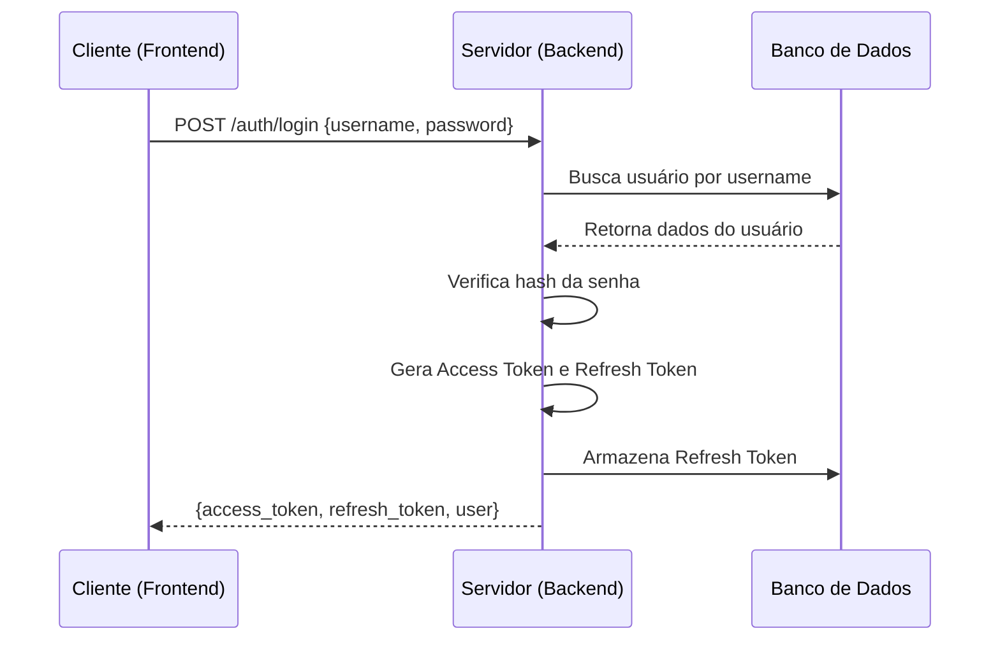
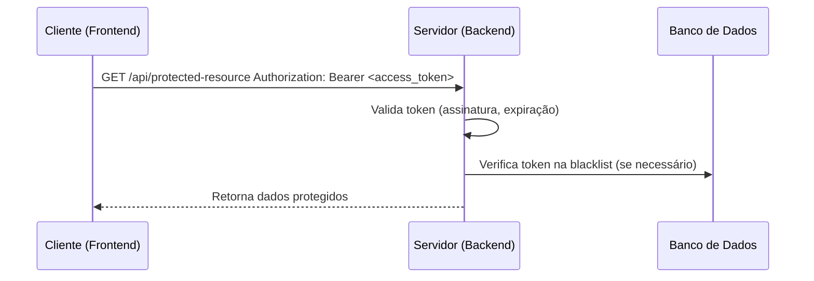
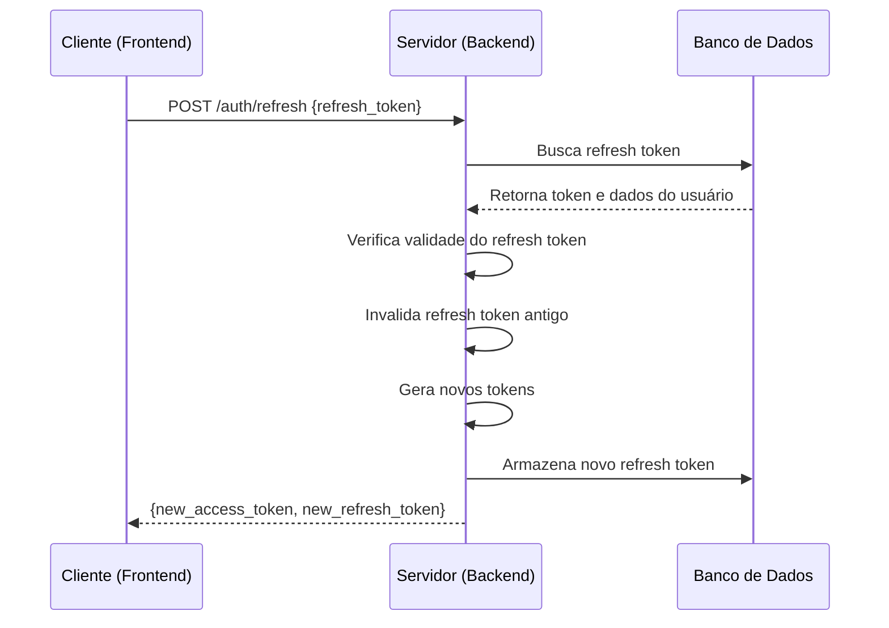
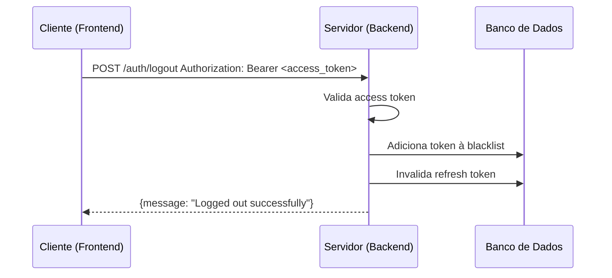

# Planejamento de Autenticação com Laravel

## 1. Introdução

### 1.1 Objetivo
Definir a estratégia e implementação para autenticação de usuários no sistema do CCCRJ utilizando os recursos de autenticação do Laravel (Sanctum/Passport), substituindo o sistema de autenticação simulado atualmente em uso.

### 1.2 Escopo
Este planejamento abrange:
- Estrutura e configuração de tokens de autenticação com Laravel
- Fluxo de autenticação
- Gerenciamento de sessões
- Segurança e práticas recomendadas do Laravel

## 2. Visão Geral da Autenticação com Laravel

### 2.1 Laravel Sanctum
Laravel Sanctum fornece um sistema leve para autenticação de tokens para SPA (Single Page Applications), aplicativos móveis e APIs baseadas em tokens simples.

### 2.2 Laravel Passport
Laravel Passport é um pacote completo de OAuth2 Server que fornece um backend completo para autenticação OAuth2.

## 3. Configuração da Autenticação com Laravel

### 3.1 Laravel Sanctum (Recomendado para SPA)

#### 3.1.1 Configuração
- **Tokens de API**: Tokens stateless para autenticação
- **CSRF Protection**: Proteção automática contra CSRF
- **Expiração**: Configurável via `sanctum.expiration`

#### 3.1.2 Estrutura do Token
- Tokens aleatórios armazenados no banco de dados
- Associados a usuários e com metadados

#### 3.1.3 Tempo de Expiração
- **Tokens de API**: Configurável (padrão: indefinido)
- **Sessões SPA**: Baseado em sessão do navegador

### 3.2 Laravel Passport (Para OAuth2 completo)

#### 3.2.1 Configuração
- **OAuth2 Server**: Implementação completa do OAuth2
- **Grants Suportados**: Authorization Code, Client Credentials, Password, etc.
- **Scopes**: Controle fino de permissões

#### 3.2.2 Tempo de Expiração
- **Access Token**: 1 hora (padrão)
- **Refresh Token**: 7 dias (padrão)

## 4. Fluxo de Autenticação

### 4.1 Login


### 4.2 Acesso a Recursos Protegidos


### 4.3 Renovação de Token


### 4.4 Logout


## 5. Implementação no Backend

### 5.1 Estrutura de Tokens
```javascript
// Estrutura do token JWT
const jwtStructure = {
  header: {
    alg: 'HS256',
    typ: 'JWT'
  },
  payload: {
    iss: 'cccrj-api',
    sub: userId,
    iat: Math.floor(Date.now() / 1000),
    exp: Math.floor(Date.now() / 1000) + (15 * 60), // 15 minutos
    username: user.username,
    role: user.role
  }
};
```

### 5.2 Middleware de Autenticação
```javascript
const authenticateToken = (req, res, next) => {
  const authHeader = req.headers['authorization'];
  const token = authHeader && authHeader.split(' ')[1]; // Bearer TOKEN

  if (!token) {
    return res.status(401).json({ error: 'Access token required' });
  }

  jwt.verify(token, process.env.JWT_SECRET, (err, user) => {
    if (err) {
      if (err.name === 'TokenExpiredError') {
        return res.status(401).json({ error: 'Token expired' });
      }
      return res.status(403).json({ error: 'Invalid token' });
    }
    
    // Verificar se token está na blacklist
    if (isTokenBlacklisted(token)) {
      return res.status(401).json({ error: 'Token revoked' });
    }
    
    req.user = user;
    next();
  });
};
```

### 5.3 Endpoint de Login
```javascript
app.post('/auth/login', async (req, res) => {
  try {
    const { username, password } = req.body;
    
    // Validar entrada
    if (!username || !password) {
      return res.status(400).json({ error: 'Username and password required' });
    }
    
    // Buscar usuário
    const user = await User.findOne({ where: { username } });
    if (!user) {
      return res.status(401).json({ error: 'Invalid credentials' });
    }
    
    // Verificar senha
    const isValidPassword = await bcrypt.compare(password, user.password_hash);
    if (!isValidPassword) {
      return res.status(401).json({ error: 'Invalid credentials' });
    }
    
    // Atualizar último login
    await user.update({ last_login: new Date() });
    
    // Gerar tokens
    const accessToken = jwt.sign(
      { 
        sub: user.id, 
        username: user.username, 
        role: user.role 
      },
      process.env.JWT_SECRET,
      { expiresIn: '15m' }
    );
    
    const refreshToken = jwt.sign(
      { sub: user.id },
      process.env.REFRESH_TOKEN_SECRET,
      { expiresIn: '7d' }
    );
    
    // Armazenar refresh token
    await RefreshToken.create({
      token: refreshToken,
      user_id: user.id,
      expires_at: new Date(Date.now() + 7 * 24 * 60 * 60 * 1000)
    });
    
    res.json({
      access_token: accessToken,
      refresh_token: refreshToken,
      user: {
        id: user.id,
        username: user.username,
        role: user.role
      }
    });
  } catch (error) {
    res.status(500).json({ error: 'Internal server error' });
  }
});
```

### 5.4 Endpoint de Renovação
```javascript
app.post('/auth/refresh', async (req, res) => {
  const { refresh_token } = req.body;
  
  if (!refresh_token) {
    return res.status(400).json({ error: 'Refresh token required' });
  }
  
  try {
    // Verificar refresh token
    const decoded = jwt.verify(refresh_token, process.env.REFRESH_TOKEN_SECRET);
    
    // Buscar token no banco
    const storedToken = await RefreshToken.findOne({
      where: { 
        token: refresh_token,
        user_id: decoded.sub,
        expires_at: { [Op.gt]: new Date() }
      }
    });
    
    if (!storedToken) {
      return res.status(401).json({ error: 'Invalid refresh token' });
    }
    
    // Invalidar token antigo
    await storedToken.destroy();
    
    // Buscar usuário
    const user = await User.findByPk(decoded.sub);
    if (!user) {
      return res.status(401).json({ error: 'User not found' });
    }
    
    // Gerar novos tokens
    const newAccessToken = jwt.sign(
      { 
        sub: user.id, 
        username: user.username, 
        role: user.role 
      },
      process.env.JWT_SECRET,
      { expiresIn: '15m' }
    );
    
    const newRefreshToken = jwt.sign(
      { sub: user.id },
      process.env.REFRESH_TOKEN_SECRET,
      { expiresIn: '7d' }
    );
    
    // Armazenar novo refresh token
    await RefreshToken.create({
      token: newRefreshToken,
      user_id: user.id,
      expires_at: new Date(Date.now() + 7 * 24 * 60 * 60 * 1000)
    });
    
    res.json({
      access_token: newAccessToken,
      refresh_token: newRefreshToken
    });
  } catch (error) {
    if (error.name === 'TokenExpiredError') {
      res.status(401).json({ error: 'Refresh token expired' });
    } else {
      res.status(500).json({ error: 'Internal server error' });
    }
  }
});
```

## 6. Implementação no Frontend

### 6.1 Serviço de Autenticação
```javascript
class AuthManager {
  constructor(apiClient) {
    this.api = apiClient;
    this.refreshPromise = null;
  }
  
  async login(username, password) {
    try {
      const response = await this.api.request('/auth/login', {
        method: 'POST',
        body: JSON.stringify({ username, password })
      });
      
      // Armazenar tokens
      localStorage.setItem('access_token', response.access_token);
      localStorage.setItem('refresh_token', response.refresh_token);
      
      // Armazenar informações do usuário
      this.setUser(response.user);
      
      return response;
    } catch (error) {
      throw error;
    }
  }
  
  async logout() {
    try {
      const token = this.getAccessToken();
      if (token) {
        await this.api.request('/auth/logout', {
          method: 'POST',
          headers: {
            'Authorization': `Bearer ${token}`
          }
        });
      }
    } catch (error) {
      console.error('Erro ao fazer logout:', error);
    } finally {
      // Limpar tokens e usuário
      localStorage.removeItem('access_token');
      localStorage.removeItem('refresh_token');
      this.clearUser();
    }
  }
  
  getAccessToken() {
    return localStorage.getItem('access_token');
  }
  
  getRefreshToken() {
    return localStorage.getItem('refresh_token');
  }
  
  async refreshAccessToken() {
    // Prevenir múltiplas chamadas simultâneas
    if (this.refreshPromise) {
      return this.refreshPromise;
    }
    
    this.refreshPromise = this._performRefresh();
    const result = await this.refreshPromise;
    this.refreshPromise = null;
    return result;
  }
  
  async _performRefresh() {
    const refreshToken = this.getRefreshToken();
    if (!refreshToken) {
      throw new Error('No refresh token available');
    }
    
    try {
      const response = await fetch('/api/auth/refresh', {
        method: 'POST',
        headers: {
          'Content-Type': 'application/json'
        },
        body: JSON.stringify({ refresh_token: refreshToken })
      });
      
      if (!response.ok) {
        throw new Error('Failed to refresh token');
      }
      
      const data = await response.json();
      
      // Atualizar tokens
      localStorage.setItem('access_token', data.access_token);
      localStorage.setItem('refresh_token', data.refresh_token);
      
      return data.access_token;
    } catch (error) {
      // Se falhar, fazer logout
      this.logout();
      throw error;
    }
  }
}
```

### 6.2 Interceptador de Requisições
```javascript
class ApiClient {
  constructor(baseURL) {
    this.baseURL = baseURL;
    this.authManager = new AuthManager(this);
  }
  
  async request(endpoint, options = {}) {
    let token = this.authManager.getAccessToken();
    
    const makeRequest = async (token) => {
      const url = `${this.baseURL}${endpoint}`;
      const config = {
        headers: {
          'Content-Type': 'application/json',
          ...options.headers
        },
        ...options
      };
      
      if (token) {
        config.headers.Authorization = `Bearer ${token}`;
      }
      
      const response = await fetch(url, config);
      return { response, token };
    };
    
    // Fazer requisição inicial
    let { response, token: currentToken } = await makeRequest(token);
    
    // Se token expirou, tentar renovar
    if (response.status === 401) {
      try {
        const newToken = await this.authManager.refreshAccessToken();
        // Tentar novamente com novo token
        const retry = await makeRequest(newToken);
        return await retry.response.json();
      } catch (refreshError) {
        // Se falhar, fazer logout e lançar erro
        this.authManager.logout();
        throw new Error('Authentication required');
      }
    }
    
    const data = await response.json();
    
    if (!response.ok) {
      throw new ApiError(data.error.message, response.status, data.error);
    }
    
    return data;
  }
}
```

## 7. Segurança

### 7.1 Práticas Recomendadas
- **HTTPS**: Todas as comunicações devem ser feitas via HTTPS
- **Armazenamento seguro**: Tokens armazenados em localStorage com cuidado
- **Tempo de expiração curto**: Access tokens com curta duração
- **Refresh tokens seguros**: Armazenados no backend com expiração
- **Blacklist**: Tokens revogados adicionados a lista negra

### 7.2 Proteção contra Ataques
- **Rate limiting**: Limitar tentativas de login
- **CORS**: Configurar corretamente para evitar CSRF
- **Validação de entrada**: Sanitizar e validar todos os dados
- **Logs de segurança**: Registrar tentativas de acesso suspeitas

### 7.3 Considerações de Armazenamento
- **Access tokens**: Não armazenar permanentemente no backend
- **Refresh tokens**: Armazenar no backend com data de expiração
- **Blacklist**: Manter lista de tokens revogados com expiração

## 8. Gerenciamento de Sessões

### 8.1 Estado da Sessão
- **Stateless**: Access tokens são stateless
- **Stateful**: Refresh tokens e blacklist são mantidos no backend

### 8.2 Revogação de Tokens
- **Logout explícito**: Tokens adicionados à blacklist
- **Expiração automática**: Tokens expiram conforme configuração
- **Revogação administrativa**: Administradores podem revogar sessões

### 8.3 Multisessão
- **Permitir múltiplas sessões**: Vários refresh tokens por usuário
- **Gerenciamento de dispositivos**: Identificar dispositivos diferentes
- **Revogação seletiva**: Revogar sessões específicas

## 9. Considerações de Performance

### 9.1 Caching
- **Tokens válidos**: Não é necessário caching pois são stateless
- **Blacklist**: Cache em memória com expiração
- **Informações de usuário**: Cache temporário de dados de usuário

### 9.2 Escalabilidade
- **Stateless**: Facilita horizontal scaling
- **Banco de dados**: Refresh tokens e blacklist devem ser replicados
- **Redis**: Considerar uso para blacklist em ambientes distribuídos

## 10. Plano de Migração

### 10.1 Fase 1: Infraestrutura
- Configurar ambiente de backend
- Implementar endpoints de autenticação
- Configurar banco de dados para refresh tokens

### 10.2 Fase 2: Integração
- Substituir sistema de autenticação simulado
- Implementar tokens no frontend
- Testar fluxos de login/logout

### 10.3 Fase 3: Segurança
- Implementar blacklist de tokens
- Configurar rate limiting
- Adicionar logs de segurança

### 10.4 Fase 4: Otimização
- Implementar caching
- Configurar refresh automático
- Adicionar gerenciamento de sessões